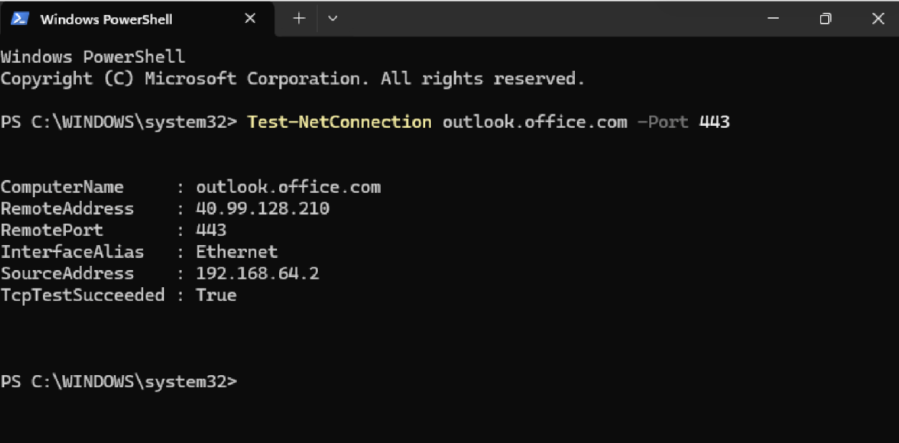

# Scenario 10 — IT Service Desk Ticket Management & Outlook Troubleshooting

## 1. Objective

The objective of this lab was to simulate a Level 1 IT Service Desk environment by creating a support request form, managing incidents in an Excel ticket tracker, performing basic technical troubleshooting, and escalating unresolved issues.

This exercise demonstrates practical skills relevant to IT Helpdesk, Service Desk Analyst, and Desktop Support roles.

## 2. Lab Environment

**Tools used:**
- Microsoft Forms — IT support request submission
- Microsoft Excel Online — Manual incident tracking
- Microsoft Entra ID — Test user accounts
- Windows 11 virtual machine — Troubleshooting environment
- Windows Command Prompt and PowerShell — Network diagnostics
- Microsoft Outlook — Application testing
- UTM — Virtual machine platform

**Note:** Microsoft Forms and the Excel ticket tracker were managed separately using a personal Microsoft account. This lab did not include an automated ticketing integration.

## 3. Creating the IT Support Request Form

I created an **Enterprise IT Support – Service Desk Request Form** using Microsoft Forms.

The form collected the following information:

- Employee name and email address
- Department
- IT issue category
- Reported urgency
- Detailed issue description
- Affected device name
- Preferred contact method
- Number of users affected

I submitted fictional employee requests to test the form and verify that responses were recorded successfully.

## 4. Building the Incident Ticket Tracker

I created a separate Excel workbook named **Enterprise IT Support – Ticket Tracker**.

The tracker included fields for:

- Ticket ID and response ID
- Submission date
- Employee and department
- Issue category and description
- Reported urgency and business impact
- Assigned priority and technician
- Ticket status
- Resolution notes and resolution date

I configured dropdown menus to standardise ticket priorities, technician assignments, and incident statuses.

This allowed me to simulate a basic ticket lifecycle from **Open → In Progress → Escalated or Resolved**.

## 5. Simulated Support Tickets

### INC-0001 — User Sign-in Issue

**Employee:** John Smith  
**Department:** Sales  
**Issue:** Account sign-in/access issue  
**Reported urgency:** High

This fictional request was used to practise recording an incident, assigning priority, and documenting investigation notes.

### INC-0002 — Outlook Connectivity Issue

**Employee:** Jane Doe  
**Department:** Operations  
**Issue:** Outlook desktop application reported as disconnected  
**Reported urgency:** Medium  
**Assigned technician:** Helpdesk Technician, later escalated to Level 2 Support

**Reported problem:**

The employee could not send or receive emails through the Outlook desktop application, although Outlook on the web was reported to be working.

## 6. Outlook Troubleshooting

I used my Windows 11 virtual machine to perform a simulated Level 1 investigation.

### Test 1 — DNS Resolution

I opened Command Prompt and ran:

```cmd
nslookup outlook.office.com
```

**Result:** Successful.

The command returned Microsoft service IP addresses, confirming that DNS resolution was working on the test machine.

### Test 2 — HTTPS Connectivity

I opened Windows PowerShell and ran:

```powershell
Test-NetConnection outlook.office.com -Port 443
```

**Result:**

```text
TcpTestSucceeded : True
```

This confirmed that the test machine could establish a TCP connection to the Outlook service over port 443.

### Test 3 — Outlook Application

I searched for Outlook in Windows 11 and launched the application.

**Result:** Outlook opened successfully but displayed its initial account setup screen.

The test account did not have a Microsoft 365 mailbox licence, so I could not reproduce the reported disconnected mailbox issue or verify mail synchronisation.

## 7. Ticket Escalation

Because the reported issue could not be reproduced or fully investigated in the available lab environment, I updated ticket **INC-0002**:

- **Assigned Technician:** Level 2 Support
- **Ticket Status:** Escalated
- **Resolution Date:** Left blank
- **Investigation Notes:** Recorded the DNS, HTTPS, and Outlook application test results

This simulated the correct process for escalating an unresolved incident while preserving the troubleshooting information for the next support team.

## 8. Skills Demonstrated

- IT service request intake
- Manual incident registration and tracking
- Incident prioritisation
- Ticket assignment and lifecycle management
- Windows network troubleshooting
- DNS resolution testing
- TCP port connectivity testing
- Microsoft Outlook troubleshooting
- Technical documentation
- Incident escalation
- Understanding the limits of Level 1 support

## 9. Key Learning Outcomes

This lab helped me understand how a Service Desk manages support requests from initial submission through investigation and escalation.

I also practised documenting technical findings accurately. A successful network test does not necessarily mean an application issue has been resolved.

**The Outlook incident remained unresolved and was escalated.** All employee requests were fictional, and troubleshooting was performed in a controlled home lab rather than on a production employee device.

## 10. Screenshots and Evidence
### Evidence — Outlook HTTPS Connectivity Test

The PowerShell test confirmed that the Windows 11 VM could establish a TCP connection to Microsoft's Outlook service over port 443.



**Result:** TcpTestSucceeded: True

**Note:** This confirms network connectivity from the test VM, not resolution of the simulated Outlook incident.
The following screenshots can be added to demonstrate the lab:

1. Microsoft Forms — IT Support Request Form
2. Excel — Incident Ticket Tracker
3. Command Prompt — Successful Outlook DNS lookup
4. PowerShell — Successful HTTPS connectivity test
5. Outlook — Initial account setup screen

Sensitive information, including passwords and authentication secrets, must be excluded from published screenshots.
